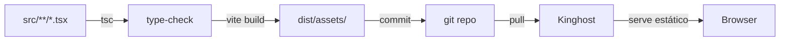

# Frontend MaposV5 — React + Vite + CoreUI

> Documentação do frontend moderno (Fases 1-5) que coexiste com o sistema legado em PHP/CodeIgniter.

---

## Visão Geral

A partir de 2026-06, o MaposV5 roda com **dois frontends**:

| Frontend | Tecnologia            | URL / Acesso                     | Responsabilidade                                  |
|----------|-----------------------|----------------------------------|---------------------------------------------------|
| Legado   | PHP + CodeIgniter 3   | `/index.php/...` (rotas MVC)     | Telas densas, formulários longos, impressão       |
| **Novo** | **React 18 + Vite**   | **`/app.html`** (SPA)            | CRUD rápido, listagens paginadas, dashboards     |

O novo frontend **NÃO substitui** o legado. Ele adiciona uma camada React servida como SPA, com roteamento client-side. Cada página nova é um **chunk lazy-loaded** — o bundle inicial carrega só o essencial, e cada rota baixa o seu próprio pedaço.

### Stack

- **React 18.3** + **TypeScript 5.6** (strict mode)
- **Vite 5.4** (build + dev server)
- **CoreUI React 5.12** (componentes)
- **React Router 6.26** (SPA routing)
- **Bootstrap 5** (utility classes + grid)
- **Vitest** + **Testing Library** + **jsdom** (testes)
- **Intl API** (formatação locale-aware)

### Estatísticas do Bundle (build de produção)

```
react-vendor.js     162.57 kB │ gzip:  53.04 kB  (React + ReactDOM)
coreui-vendor.js     81.10 kB │ gzip:  24.26 kB  (CoreUI)
chart-vendor.js     207.56 kB │ gzip:  71.21 kB  (Chart.js)
main.js              58.67 kB │ gzip:  22.36 kB  (App shell + hooks)
─────────────────────────────────────
Inicial              509.90 kB │ gzip: 170.92 kB (1 request)
```

Cada página é um chunk separado, baixado sob demanda:

| Página          | Chunk        | gzip   |
|-----------------|--------------|--------|
| Dashboard       | 34.44 kB     | 13.79  |
| ClientesDetail  | 12.17 kB     | 2.82   |
| VendasDetail    | 11.15 kB     | 2.73   |
| OsDetail        | 10.19 kB     | 2.51   |
| Kanban          |  3.34 kB     | 1.48   |
| Nfse            |  3.31 kB     | 1.38   |
| Relatorios      |  3.09 kB     | 1.17   |
| Cobrancas       |  2.84 kB     | 1.20   |
| ...             |              |        |

---

## Estrutura de Pastas

```
assets/frontend/
├── src/
│   ├── api/             # Cliente HTTP + crud genérico
│   ├── components/      # Componentes reutilizáveis
│   │   ├── layout/      # AppShell, Sidebar, Topbar
│   │   └── ui/          # DataTable, FormModal, Toast, FileUpload
│   ├── hooks/           # useCrudForm, useApi
│   ├── i18n/            # Dicionários pt-BR + en-US
│   ├── pages/           # 17 páginas (1 por rota)
│   ├── types/           # Tipos TypeScript compartilhados
│   ├── App.tsx          # Rotas + Suspense
│   ├── config.ts        # Lê window.APP_CONFIG
│   └── main.tsx         # Entry point
├── tests/               # Testes Vitest
│   ├── setup.ts
│   ├── a11y.test.tsx
│   ├── i18n.test.tsx
│   ├── toast.test.tsx
│   ├── useCrudForm.test.ts
│   └── upload.test.ts
├── dist/                # Build de produção (commitado no Git)
├── index.html           # Shell autenticado
├── login.html           # Shell de login (público)
├── package.json
├── tsconfig.json
├── vite.config.ts
└── vitest.config.ts
```

---

## Como Desenvolver

### Pré-requisitos

- Node.js 20+
- npm 10+

### Comandos

```bash
cd assets/frontend

# Instalar dependências (uma vez)
npm install

# Dev server com hot reload em http://localhost:5173
npm run dev

# Build de produção (gera dist/)
npm run build

# Preview do build
npm run preview

# Rodar testes
npm test           # modo watch
npx vitest run     # uma vez

# Type-check
npx tsc --noEmit
```

### Variáveis de Configuração

O React lê `window.APP_CONFIG` (injetado pelo PHP) com:

```ts
interface AppConfig {
    baseUrl: string;          // ex: 'http://localhost/'
    userName: string;         // nome do usuário logado
    userEmail: string;
    permissions: string[];    // ['vOs', 'eVenda', ...]
    theme: 'white' | 'puredark' | 'darkviolet' | 'darkorange' | 'whitegreen' | 'whiteblack';
    csrfName: string;         // ex: 'csrf_test_name'
    csrfHash: string;         // token atual
}
```

O CSRF é lido do `<meta name="csrf">` no `index.html` PHP.

---

## Adicionar uma Nova Página

1. **Backend** (se necessário): criar endpoint PHP em `application/controllers/Xxx.php` que estende `ApiCrudTrait` ou expõe `api_detail()`.

2. **Frontend**: criar `src/pages/Xxx.tsx`:

   ```tsx
   import { CrudTable } from '../components/ui/CrudTable';
   import type { FieldDef } from '../components/ui/FormModal';
   import type { Row, ColumnDef } from '../types';

   const columns: ColumnDef<Row>[] = [
       { key: 'id', label: '#', width: '80px', sortable: true },
       { key: 'nome', label: 'Nome', sortable: true },
   ];

   const fields: FieldDef[] = [
       { key: 'nome', label: 'Nome', type: 'text', required: true },
   ];

   export default function XxxPage() {
       return (
           <CrudTable<Row>
               controller="xxx"
               title="Xxx"
               icon="cilXxx"
               columns={columns}
               fields={fields}
               defaultValue={{ nome: '' }}
               entityName="Xxx"
           />
       );
   }
   ```

3. **Rota**: adicionar em `src/App.tsx`:

   ```tsx
   const XxxPage = lazy(() => import('./pages/Xxx'));

   <Route path="/xxx" element={<XxxPage />} />
   ```

4. **Sidebar**: registrar em `src/components/layout/Sidebar.tsx` (procura `navItems`).

5. **Build + commit**:
   ```bash
   npm run build
   git add dist/  # IMPORTANT: dist/ vai pro Git
   git commit -m "feat(xxx): nova página React"
   ```

---

## Componentes Principais

### `<CrudTable controller="...">`

Encapsula lista + criar + editar + excluir numa única chamada. Combina `DataTable` + `FormModal` + `useCrudForm`.

```tsx
<CrudTable<Cliente>
    controller="clientes"
    title="Clientes"
    icon="cilPeople"
    columns={columns}
    fields={fields}
    defaultValue={{ nomeCliente: '', ativo: 1 }}
    entityName="Cliente"
    renderRowActions={(r) => (
        <Link to={`/clientes/${r.idClientes}`}>
            <CIcon icon="cilEye" />
        </Link>
    )}
/>
```

### `<DataTable controller="...">`

Lista paginada que lê direto da API. Suporta busca, ordenação, paginação server-side.

### `<FormModal fields={...}>`

Modal genérico para criar/editar. Suporta `text`, `textarea`, `number`, `select`, `checkbox`, `date`.

### `useCrudForm<Row>`

Hook que gerencia o estado do formulário + submit.

```tsx
const { form, setForm, open, editing, loading, error, openEdit, close, submit } = useCrudForm<Os>({
    controller: 'os',
    defaultValue: { status: 'Aberto' },
    onSuccess: () => toast.success('Salvo!'),
});
```

### `<FileUpload entity="os" entityId={id}>`

Upload com drag&drop, validação de tipo/tamanho, integrado com o backend PHP.

### `useTranslation()`

i18n com fallback pt-BR. Suporta 2 locales: `pt-BR` (default) e `en-US`.

```tsx
const { t, locale, setLocale, formatDate, formatCurrency, formatNumber } = useTranslation();

<h1>{t('login.title')}</h1>
<p>{t('crud.created', { entity: 'Cliente' })}</p>
<button onClick={() => setLocale('en-US')}>English</button>
```

---

## Testes

```bash
# Rodar tudo
npx vitest run

# Rodar com cobertura
npx vitest run --coverage

# Watch mode
npx vitest
```

**45 testes** distribuídos em 5 arquivos:

| Arquivo                   | Testes | Cobre                              |
|---------------------------|-------:|------------------------------------|
| `a11y.test.tsx`           |      5 | ARIA, roles, navegação por teclado |
| `i18n.test.tsx`           |     13 | Tradução + formatters Intl         |
| `toast.test.tsx`          |      7 | Sistema de notificações            |
| `useCrudForm.test.ts`     |      9 | Hook de CRUD                       |
| `upload.test.ts`          |     11 | Upload de arquivos                 |

### Como escrever um teste

```tsx
import { describe, it, expect } from 'vitest';
import { render, screen } from '@testing-library/react';
import MyComponent from '../src/components/MyComponent';

describe('MyComponent', () => {
    it('renders the title', () => {
        render(<MyComponent title="Hello" />);
        expect(screen.getByText('Hello')).toBeInTheDocument();
    });
});
```

---

## Integração com PHP Legado

### Entry point

O `index.html` (gerado pelo Vite) é servido pelo PHP em `application/views/tema/app.php`:

```php
<!DOCTYPE html>
<html>
<head>
    <meta name="csrf" content="<?= $csrf_hash ?>">
    <script>
        window.APP_CONFIG = <?= json_encode([
            'baseUrl'     => base_url(),
            'userName'    => $this->session->userdata('nome_admin'),
            'permissions' => $permissoes,
            'theme'       => $tema,
        ]) ?>;
    </script>
    <link rel="stylesheet" href="<?= base_url('assets/dist/assets/main.css') ?>">
</head>
<body>
    <div id="root"></div>
    <script type="module" src="<?= base_url('assets/dist/assets/main.js') ?>"></script>
</body>
</html>
```

### Autenticação

O PHP cria a sessão normalmente. O React verifica via `GET /api/me` se a sessão é válida; se não, redireciona para o login legado.

### CSRF

Todas as chamadas `POST/PUT/DELETE` enviam o header `X-CSRF-Token` (lido do `<meta name="csrf">`).

### Permissões

O `useAuth()` hook expõe `permissions: string[]` e helpers:

```tsx
const { can } = useAuth();
{can('eOs') && <button>Editar</button>}
```

---

## Build Pipeline



1. **Local**: `npm run build` gera `dist/`
2. **Commit**: `git add assets/frontend/dist/` (vai pro Git)
3. **Deploy**: `git pull` na Kinghost — arquivos estáticos servidos por Apache

> **IMPORTANTE**: A Kinghost é shared hosting e **não tem Node.js**. Por isso `dist/` é commitado e nunca buildado no servidor.

---

## Troubleshooting

### "Failed to fetch" em todas as chamadas

O `baseUrl` em `window.APP_CONFIG` está errado. Verifique no DevTools:

```js
console.log(window.APP_CONFIG);
// Esperado: { baseUrl: 'https://seu-dominio.com/', ... }
```

### Página em branco após build

Confirme que `dist/index.html` está sendo servido pelo PHP. O servidor estático sozinho não tem como resolver rotas React (`/dashboard`, `/os/123`).

### CSRF inválido

O hash CSRF expira a cada requisição POST. Garanta que o header `X-CSRF-Token` é atualizado a cada chamada:

```ts
api.interceptors.request.use((config) => {
    const hash = document.querySelector('meta[name="csrf-hash"]')?.content;
    if (hash) config.headers['X-CSRF-Token'] = hash;
    return config;
});
```

### Lazy chunk não carrega

Confirme que o `base: './'` no `vite.config.ts` produz paths relativos:

```ts
export default defineConfig({
    base: './',  // ou 'auto' se usar asset helper
});
```

---

## Convenções de Código

- **Componentes**: PascalCase (`DataTable`, `FileUpload`)
- **Hooks**: camelCase com prefixo `use` (`useCrudForm`, `useTranslation`)
- **Tipos**: PascalCase, uma interface por arquivo quando compartilhado
- **CSS**: usar utility classes do CoreUI/Bootstrap; CSS-in-JS só se necessário
- **Comentários**: JSDoc em funções públicas; inline só quando não óbvio
- **Commits**: Conventional Commits em português (`feat:`, `fix:`, `refactor:`)

---

## Roadmap

- [ ] **Fase 6**: Migrar 5 páginas restantes (Obras, Arquivos, Relatórios, Usuários, Config) — parcialmente feito
- [ ] **Fase 7**: Service Worker para offline
- [ ] **Fase 8**: Testes E2E com Playwright
- [ ] **Fase 9**: Tema dark por usuário (já suportado, falta UI)
- [ ] **Fase 10**: PWA instalável

---

<p align="center">Desenvolvido com ❤️ para o MaposV5</p>
